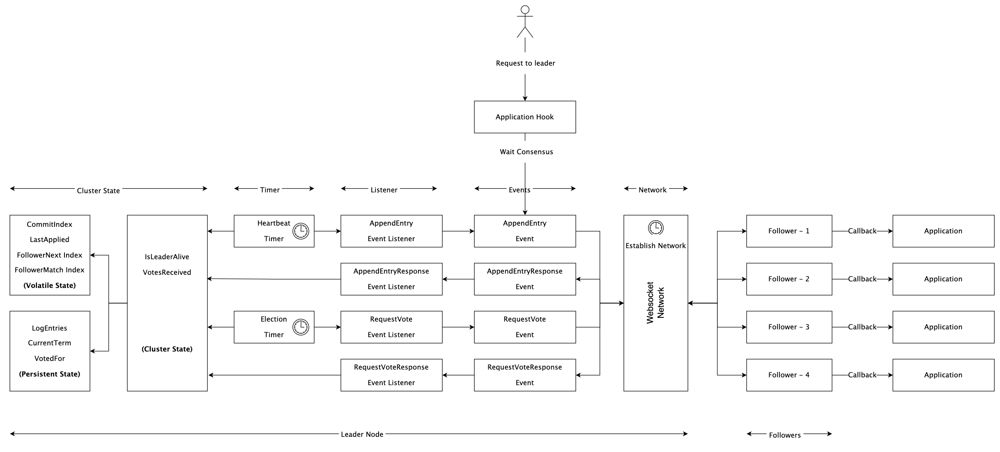

# RAFT using the Actor model and WebSockets

This is an implementation of the RAFT consensus algorithm in Java using the Actor model and WebSockets to establish communication between nodes. This implementation is designed to handle network partitions and ensures data consistency.

## RAFT Consensus Algorithm

RAFT is a consensus algorithm for managing a replicated log. It is designed to be easy to understand and implement, making it a popular choice for building distributed systems. RAFT works by electing a leader among a group of nodes and then using a replicated log to ensure that all nodes agree on the same state.

The RAFT algorithm is divided into two main parts: leader election and log replication. Leader election is used to select a single node to act as the leader, while log replication ensures that all nodes have the same log entries in the same order.

RAFT uses four main types of events for communication between nodes:

- `AppendEntry`: sent by the leader to replicate log entries
- `AppendEntryResponse`: sent by followers to acknowledge receipt of `AppendEntry`
- `RequestVote`: sent by candidates to request votes during leader election
- `RequestVoteResponse`: sent by followers to grant or deny votes during leader election

## Actor Model and WebSockets

In this implementation, the Actor model is used to handle an event. Each node is represented by a Java object that has its own state and behavior. Nodes communicate with each other using WebSockets, which provides a low-latency, bidirectional communication channel that is well-suited for real-time applications.

When a node wants to send a message to another node, it uses the WebSocket connection to send the message. The receiving node can then take appropriate action based on the message.

## Architecture

## Data Persistence and Snapshotting

Please note that this implementation does not handle data persistence and snapshotting. It is the responsibility of the application to handle those aspects. The RAFT implementation only handles network partitions and ensures data consistency between the nodes.

## Key-Value Store Example

As an example of how to use this implementation, I have included a simple key-value store implementation in the `KeyValueController` class. The key-value store allows clients to store and retrieve key-value pairs in a distributed manner.

Clients can interact with the key-value store using a REST API that is exposed by the `KeyValueController`. The `KeyValueController` uses the RAFT implementation to ensure that all nodes have a consistent view of the key-value store.
